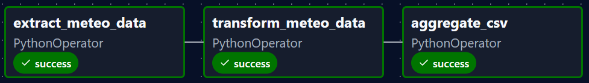
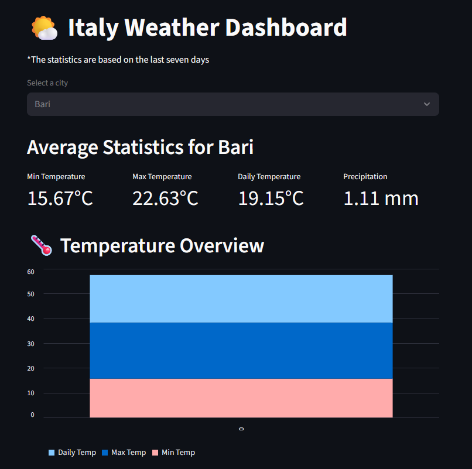

# 🇮🇹 Dashboard Meteo Italia
[](README.md)

Questo è un **progetto** creato per familiarizzare con **Apache Airflow**, combinato con **Streamlit** per la visualizzazione dei dati.  
Estrae, trasforma e visualizza i dati meteo delle principali città italiane utilizzando la [API Open-Meteo](https://open-meteo.com/).

---

## **Funzionalità**

- Estrazione giornaliera dei dati meteo per più città italiane.
- Pulizia e aggregazione automatica delle statistiche di temperatura e precipitazione.
- Dashboard Streamlit con:
  - Selezione di una singola città
  - Metriche principali mostrate in una riga
  - Grafici a barre per temperature e precipitazioni
- Completamente containerizzato con Docker per test locali e riproducibilità.


---

## **Installazione & Setup**

1. **Clona il repository**:

```bash
git clone <url-del-tuo-repo>
cd <cartella-del-repo>
```

2. **Costruisci l'immagine Docker**:

```bash
docker-compose build
```

3. **Avvia Airflow standalone**:

```bash
docker-compose up
```

- L'interfaccia di Airflow sarà disponibile su: [http://localhost:8080](http://localhost:8080)  
- Esegui manualmente il DAG `weather_dag` o attendi l'esecuzione giornaliera programmata.


---

## **Dashboard Streamlit**

1. Assicurati che il file `aggregated_stats.csv` esista in:

```
airflow/data/dashboard_csv/aggregated_stats.csv
```

2. Avvia la dashboard:

```bash
cd dashboard
streamlit run app.py
```

3. Apri la dashboard nel browser (di solito `http://localhost:8501`).  
4. Seleziona una città per vedere **metriche** e **grafici** relativi a quella città.


---

## **Configurazione**

- **Lista delle città**: `airflow/config/cities.json`  

Esempio:

```json
[
  {"name": "Roma", "lat": 41.9028, "lon": 12.4964},
  {"name": "Milano", "lat": 45.4642, "lon": 9.1900}
]
```

- Puoi aggiungere o rimuovere città qui; il DAG le elaborerà automaticamente.

---

## **Dipendenze**

- Python 3.13  
- Airflow (Apache)  
- Pandas  
- Requests  
- Streamlit  

Tutte le dipendenze sono installate nel container Docker.

---

## **Note sull’uso**

- Il DAG viene eseguito giornalmente e salva: CSV raw → statistiche processate → CSV aggregato.  
- Streamlit legge il **CSV aggregato** per mostrare metriche e grafici.  
- Per visualizzare trend giornalieri, puoi modificare la dashboard per leggere i **CSV raw**.

---