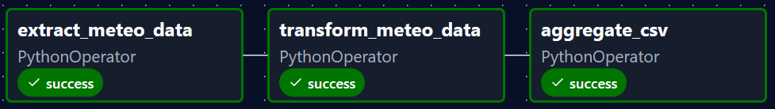

# Italy Weather Dashboard
[](README-it.md)
This is a **learning project** created to familiarize with **Apache Airflow**, combined with **Streamlit** for visualization.  
It extracts, transforms, and visualizes weather data for major Italian cities using the [Open-Meteo API](https://open-meteo.com/).


---

## **Features**

- Daily weather data extraction for multiple Italian cities.
- Automatic cleaning and aggregation of temperature and precipitation statistics.
- Streamlit dashboard with:
  - Single city selection
  - Key metrics displayed in a row
  - Bar charts for temperatures and precipitation
- Fully Dockerized for local testing and reproducibility.

---

## **Installation & Setup**

1. **Clone the repository**:

```bash
git clone <your-repo-url>
cd <repo-folder>
```

2. **Build the Docker image**:

```bash
docker-compose build
```

3. **Run Airflow standalone**:

```bash
docker-compose up
```

- Airflow UI will be available at: [http://localhost:8080](http://localhost:8080)  
- Trigger the `weather_dag` manually or wait for the daily schedule.


---

## **Streamlit Dashboard**

1. Make sure `aggregated_stats.csv` exists in:

```
airflow/data/dashboard_csv/aggregated_stats.csv
```
>**(should appear after the pipeline is completed)*

2. Start the dashboard:

```bash
cd dashboard
streamlit run app.py
```

3. Open the dashboard in your browser (usually `http://localhost:8501`).  
4. Select a city to see **metrics** and **charts** for that city.

---

## **Configuration**

- **Cities list**: `airflow/config/cities.json`  

Example:

```json
[
  {"name": "Rome", "lat": 41.9028, "lon": 12.4964},
  {"name": "Milan", "lat": 45.4642, "lon": 9.1900}
]
```

- You can add or remove cities here; the DAG will automatically process them.

---

## **Dependencies**

- Python 3.13  
- Airflow (Apache)  
- Pandas  
- Requests  
- Streamlit  

All dependencies are installed in the Docker container.

---

## **Usage Notes**

- DAG runs daily and stores raw CSVs → processed stats → aggregated CSV.  
- Streamlit reads **aggregated CSV** to display metrics and charts.  
- If you want daily trends, you can modify the dashboard to read the **raw CSVs** instead.

---
